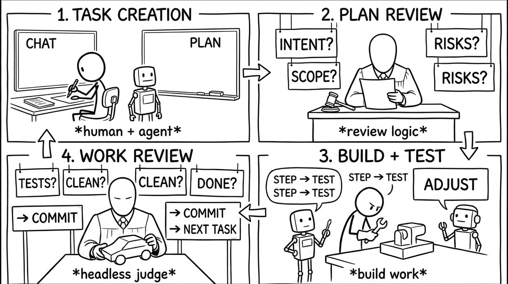

# Claude Playbook

A Claude Code plugin for granting your agent real autonomy - the kind where you say "build this" and check back in 20 minutes.

## What it looks like

```
You:    "Add rate limiting to the API endpoints"
Agent:  creates task, writes a 12-gate plan
Judge:  reviews the plan blind (no conversation access - no anchoring)
Agent:  works gate by gate, checking boxes, annotating findings
You:    (20 minutes later) read the task.md, see exactly what happened and why
```

## Everything is a task

All activity gravitates around task.md files. A task.md is a first-class object - value, program, and self-inspector at once. You can execute it (the agent works through gates top to bottom), pass it between agents (a fresh session picks it up and continues), analyze it (the judge reviews the plan blind), chain operations on it (create → judge → build → review → judge again), and cross-reference it against your original messages for intent alignment.

Each operation takes the file, transforms it - adds judge findings, checks gates, annotates discoveries, flags misalignments - and yields the enriched file to the next operation. The task.md accumulates everything as it flows through the pipeline. When it's done, it's both the record of what happened and the program that drove it.

The plan and execution co-evolve through the document. The agent edits the plan as it learns - gates get annotated, steps added or removed as reality demands. Reflection gates make the task introspect itself mid-execution: "Am I solving the stated problem or a different one?" reshapes the remaining plan from inside. You steer anytime by chatting - "wrong approach," "skip that," "focus on X" - your messages arrive between gates.

Most agent tools manage tasks as inert data - a list, a database row, a checklist something external acts on. These tasks are live. They run, get judged, reflect on themselves, pass between agents, and accumulate the full reasoning history as they go.

<p align="center"></p>

## What orbits the task

Everything else exists to serve the task lifecycle.

**The mind map** (`MIND_MAP.md`) orients the agent before it creates a task. A flat list of numbered nodes with `[N]` cross-references - a knowledge graph in plain text, kept under 10KB. One line per node means clean diffs, easy grep, and append-only growth. It tracks intent from the top down (what we're building and why) and implementation from the bottom up (what we learned by building it). The agent loads it at session start and knows the project in seconds instead of thrashing around the codebase. Your thirtieth session benefits from what was learned in the first.

**The judge** reviews the task plan before work begins. It sees the full codebase but not your conversation - no anchoring, no social pressure to agree. The plan emerges from the intersection of three contexts: you (the intent), the work agent (the conversation and codebase), and the judge (the codebase without the conversation). On complex tasks, run multiple rounds - each pass sharpens the plan from a different angle.

**The chat log** records every message you send with timestamps and IDs. A design-phase gate cross-references it against the task - checking that the task captures everything you said and pulling in details mentioned conversationally but never formalized. This is intent alignment: your messages are one ledger, the task is the other, and they have to balance.

**Hooks** are the physics. The agent can't edit code without an active task. Can't skip gates. Can't call work done with gates left unchecked. These block the action at the system level - warnings had a 2.7% correction rate across 612 observations, so we don't warn.

**Tests and the sandbox** are the two halves of the safety equation. Tests make consequences observable to the agent in real time - without them, it navigates blind. With them, it perceives and adapts. The better the tests, the longer the agent can run unsupervised. The sandbox wraps the agent in OS-level write containment - your project directory is writable, `.git` is read-only, everything else is blocked at the kernel level. No Docker. Tests catch logical errors; the sandbox catches blast radius.

<p align="center"></p>

## Install

```
claude plugin marketplace add horiacristescu/claude-playbook-plugin
```

Then in any project, tell the agent `/playbook:init`. This creates `CLAUDE.md`, `MIND_MAP.md`, and the task CLI.

## Usage

Tell the agent what you want. It creates a task, writes a plan, gets the plan reviewed, then works through the gates.

```
tasks new feature user-auth        # create task
tasks work 12                      # activate - hooks start enforcing
# ... agent works through gates ...
tasks work done                    # deactivate when finished
```

For hands-off work, run in sandbox mode - bypass-permissions inside OS-level containment:

```
sandbox
```

The sandbox agent runs without permission prompts but can't touch `.git` or write outside your project. You still steer by chatting.

## Two agents, one task

The intended setup splits planning from execution. The **orchestrator** runs outside the sandbox - writes plans, reviews results, commits. The **sandbox agent** runs in bypass mode - picks up the task.md and implements against it. The document is the handoff point. Multiple agents across sessions can pick up the same task and continue where the last one left off.

## The mind map in practice

> **[1] Project Overview** - Claude Playbook packages an agent steering methodology as a distributable plugin **[2]**. The core insight: the solution to agent autonomy is text, not code **[18]**. Refined across 300+ tasks...
>
> **[5] Task System** - Each task is a living document that IS the execution trace **[19]**. Design Phase → Work Plan → Pre-review. Task types: feature → Build, explore → Investigate, review → Evaluate...
>
> **[19] Document-Driven Execution** - task.md is a computational model: checkboxes = state, sections = memory, templates = instruction set, agent = interpreter **[5]**...

The agent follows links - **[5]** from the overview reaches the task system, **[19]** from there reaches the execution model. Architecture, decisions, context - the things that vanish between sessions persist across them.

## When not to use it

Quick questions, one-line fixes, shell commands, doc tweaks. The structure is for work that benefits from it - features, refactors, investigations, multi-file changes. Anything where you'd want to say "build this" rather than watch every keystroke.

Refined across 300+ tasks on multiple codebases - macOS, Linux, and Windows.
