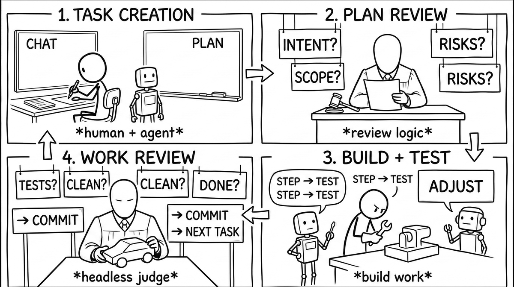

# Claude Playbook

A Claude Code plugin for granting your agent real autonomy - the kind where you say "build this" and check back in 20 minutes.

## What it looks like

```
You:    "Add rate limiting to the API endpoints"
Agent:  creates task, writes a 12-gate plan
Judge:  reviews the plan blind (no conversation access - no anchoring)
Agent:  works gate by gate, checking boxes, annotating findings
You:    (20 minutes later) read the task.md, see exactly what happened and why
```

## Everything is a task

Work happens in task.md files. The agent works through gates top to bottom, checking boxes and annotating findings. A judge can review it blind at any point. A fresh session picks it up and continues from wherever the last one stopped.

Each operation leaves a mark - judge findings, checked gates, annotated discoveries, flagged wrong turns. When the task is done it's the record of what happened and why.

The plan changes as work progresses. The agent edits gates as it learns - steps get added or removed as reality demands. A reflection gate mid-task asks "am I solving the stated problem or a different one?" and the remaining plan gets revised from the answer. You steer by chatting at any point - "wrong approach," "skip that," "focus on X."

Most agent tools treat tasks as inert data - a row in a list, something external acts on. These tasks run, get judged, carry their full history, and can be handed off between agents and sessions.

<p align="center"></p>

## What comes with it

**The mind map** (`MIND_MAP.md`) is a flat numbered list of project knowledge - architecture, decisions, what was tried and why. Kept under 10KB, one node per line, `[N]` cross-references. The agent reads it at session start instead of re-reading the codebase. Session thirty picks up from session one without re-learning anything.

**The judge** reads the task plan before any code gets written. It sees the full codebase but not your conversation - no pressure to agree with you, no anchoring to the approach you already committed to in chat. On complex tasks, run a panel of several models; the hit rate on catching real problems goes up.

**The chat log** records every message you send. A gate in the design phase checks the task against it - pulling in things you said conversationally but never wrote down. If your messages and the task don't agree, that's a bug in the plan, not just a documentation gap.

**Hooks** enforce the structure at the system level. The agent can't edit code without an active task, can't skip gates, can't mark work done with gates still open. Warnings had a 2.7% correction rate across 612 observations, so we block instead.

**Tests and the sandbox** cover different failure modes. Tests make the consequences of a wrong change visible immediately - the agent sees the failure and corrects course. The sandbox puts a hard boundary on blast radius: your project directory is writable, `.git` is read-only, everything outside the project is blocked at the kernel level. No Docker. Tests catch logic errors; the sandbox catches the rest.

<p align="center"></p>

## Install

```
claude plugin marketplace add horiacristescu/claude-playbook-plugin
```

Restart Claude Code, then in any project tell the agent `/playbook:init`. This creates `CLAUDE.md`, `MIND_MAP.md`, and `.claude/bin/tasks` — the task CLI.

To upgrade later: `/playbook:upgrade`.

## Usage

Tell the agent what you want. It creates a task, writes a plan, gets the plan reviewed, then works through the gates — you chat, the agent runs the commands.

```
You:    "Add rate limiting to the API endpoints"
Agent:  tasks new feature rate-limiting
Agent:  tasks plan-review 12
Agent:  tasks work 12
Agent:  [works gate by gate]
Agent:  tasks work done
```

For plan review before the agent touches any code, ask for it explicitly:

```
You:    "review the plan before coding"
Agent:  tasks plan-review 12       # single judge, blind
Agent:  tasks panel-review 12      # 7-model panel, higher discovery rate
```

For hands-off execution, run in sandbox mode — `--dangerously-skip-permissions` inside OS-level write containment:

```
sandbox
```

The sandbox uses macOS seatbelt or Linux bubblewrap to enforce write boundaries at the kernel level: your project directory is writable, `.git` is read-only, everything outside the project is blocked. The agent runs without permission prompts — no interruptions — but has no ability to escape the containment even if it tries. You still steer by chatting.

Brief the agent, let it run, read the task.md when it's done.

## Two agents, one task

One setup that works well: the **orchestrator** runs outside the sandbox - writes plans, reviews results, commits. The **sandbox agent** runs in bypass mode - picks up the task.md and implements. The task.md is what passes between them. Different agents across different sessions can pick up the same task and keep going from wherever it stopped.

## The mind map in practice

> **[1] Project Overview** - Claude Playbook packages an agent steering methodology as a distributable plugin **[2]**. The core insight: the solution to agent autonomy is text, not code **[18]**. Refined across 700+ tasks...
>
> **[5] Task System** - Each task is a living document that IS the execution trace **[19]**. Design Phase → Work Plan → Pre-review. Task types: feature → Build, explore → Investigate, review → Evaluate...
>
> **[19] Document-Driven Execution** - task.md is a computational model: checkboxes = state, sections = memory, templates = instruction set, agent = interpreter **[5]**...

Nodes cross-reference each other — **[5]** links to **[19]** which links back. Architecture decisions, past failures, things that got tried — it's all there between sessions instead of having to be re-explained.

## When not to use it

Quick questions, one-line fixes, shell commands, doc tweaks. The structure is for work that benefits from it - features, refactors, investigations, multi-file changes. Anything where you'd want to say "build this" rather than watch every keystroke.

Refined across 700+ tasks on multiple codebases - macOS, Linux, and Windows.
